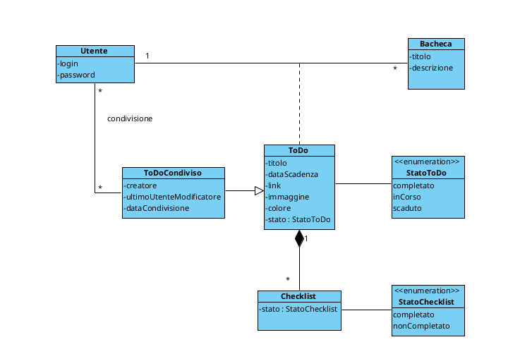

# Gestore ToDo – Progetto Java GUI

## Autore
**Matteo Grottola**  
**Matricola:** N86005687

## Descrizione del progetto

Il progetto consiste nello sviluppo di un'applicazione Java dotata di interfaccia grafica (Swing) e supportata da una base di dati relazionale, che consente la gestione delle attività personali (ToDo), ispirandosi al noto software Trello.

Gli utenti possono organizzare le attività in tre bacheche principali: **Università**, **Lavoro** e **Tempo Libero**, gestendo in modo flessibile e ordinato i propri ToDo.

---

## Funzionalità principali

- **Autenticazione Utente:** login e password univoci.
- **Gestione Bacheche:**
  - Ogni utente può creare, modificare ed eliminare le proprie bacheche.
  - Le bacheche sono classificate in: Università, Lavoro e Tempo Libero.
- **Gestione ToDo:**
  - Ogni ToDo ha titolo, data di scadenza, link, descrizione, immagine, colore di sfondo e stato (`inCorso`, `completato`, `scaduto`).
  - Possibilità di spostare i ToDo tra bacheche e riordinarli.
  - Ogni ToDo può contenere una lista di sotto-attività (**Checklist**).
  - Quando tutte le sotto-attività di una checklist sono completate, anche il ToDo viene marcato automaticamente come completato.
- **Condivisione ToDo:**
  - I ToDo possono essere condivisi con altri utenti attraverso la classe **ToDoCondiviso**.
  - L'autore può aggiungere o rimuovere utenti dalla condivisione.
  - Il ToDo apparirà nella bacheca corrispondente di ogni utente con cui è condiviso.
  - Viene registrato l’ultimo utente che ha modificato il ToDo condiviso e la data di condivisione.
- **Ricerca e Filtri:**
  - Visualizzazione dei ToDo in scadenza oggi o entro una data specifica.
  - Ricerca per nome o titolo del ToDo.
  - I ToDo scaduti appaiono evidenziati in rosso.

---

## Diagramma delle classi

### Struttura Classi (aggiornata)

- **Utente**
  - `login`
  - `password`

- **Bacheca**
  - `titolo`
  - `descrizione`

- **ToDo**
  - `titolo`  
  - `dataScadenza`  
  - `link`  
  - `immagine`  
  - `colore`  
  - `stato: StatoToDo` (inCorso, completato, scaduto)

- **Checklist**
  - `stato: StatoChecklist` (completato, nonCompletato)

- **ToDoCondiviso**
  - `creatore`  
  - `ultimoUtenteModificatore`  
  - `dataCondivisione`

- **Enumerazione StatoToDo**
  - `completato`  
  - `inCorso`  
  - `scaduto`

- **Enumerazione StatoChecklist**
  - `completato`  
  - `nonCompletato`
